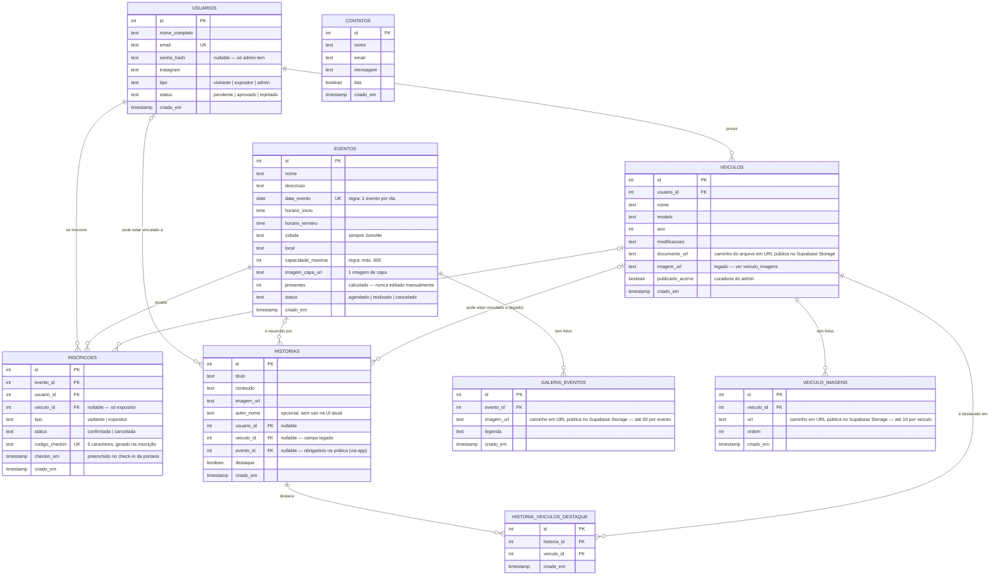

# Banco de dados — Veteran Carclub

Schema definido em `packages/backend/src/db.js` (função `migrar()`), aplicado
com `npm run db:migrar`. PostgreSQL.

## Diagrama (Mermaid ER)

> GitHub, GitLab e a maioria dos editores com suporte a Mermaid renderizam
> este bloco automaticamente. Se o seu visualizador não renderizar, cole o
> conteúdo em [mermaid.live](https://mermaid.live).

## Tabelas e regras de negócio embutidas no schema

| Tabela                       | O que guarda                                                        | Regras aplicadas com `UNIQUE`/`CHECK` (não só no código)                                                                                                                                                                                                              |
| ---------------------------- | ------------------------------------------------------------------- | --------------------------------------------------------------------------------------------------------------------------------------------------------------------------------------------------------------------------------------------------------------------- |
| `usuarios`                   | Visitantes, expositores e admins.                                   | `email` é `UNIQUE` (impede recadastro, e é a trava que bloqueia um expositor reprovado de se inscrever de novo). `senha_hash` é opcional — só quem faz login (admin) tem. `tipo`/`status` restritos por `CHECK`.                                                      |
| `eventos`                    | Encontros do clube.                                                 | `data_evento` é `UNIQUE` → **1 evento por dia**. `capacidade_maxima` tem `CHECK (<= 600)`. `cidade` tem `DEFAULT 'Joinville'` e nunca é aceito como input do cliente (ver `eventos.servico.js`).                                                                      |
| `veiculos`                   | Carros cadastrados pelos expositores.                               | `publicado_acervo` (default `false`) é a curadoria: só vira `true` quando o admin decide publicar no Acervo.                                                                                                                                                          |
| `veiculo_imagens`            | Fotos de cada veículo (até 10).                                     | Limite de 10 aplicado na camada de serviço, não no schema (evolui mais fácil que uma regra de negócio fixa).                                                                                                                                                          |
| `inscricoes`                 | A ligação usuário↔evento (e, se expositor, também o veículo).       | `UNIQUE(evento_id, usuario_id)` impede inscrição duplicada no mesmo evento. `codigo_checkin` tem índice único parcial (só entre quem já tem um código). Capacidade máxima do evento é verificada em transação com `FOR UPDATE` (não dá pra "furar" com concorrência). |
| `historias`                  | Recorte/resumo de um evento passado.                                | `evento_id` é obrigatório na validação da aplicação (zod), embora a coluna em si seja nullable no banco (flexibilidade para o schema evoluir sem migração destrutiva).                                                                                                |
| `historia_veiculos_destaque` | Curadoria: quais veículos aparecem com fotos/descrição na história. | `UNIQUE(historia_id, veiculo_id)` — mesmo veículo não se repete na mesma história.                                                                                                                                                                                    |
| `galeria_eventos`            | Fotos de um evento já realizado (até 50).                           | Limite de 50 aplicado na camada de serviço.                                                                                                                                                                                                                           |
| `contatos`                   | Mensagens do formulário de contato da Home.                         | Sem relacionamento com outras tabelas — é só uma caixa de entrada.                                                                                                                                                                                                    |

## Índices

Além das chaves primárias/estrangeiras, existem índices B-tree em `veiculos.usuario_id`, `veiculo_imagens.veiculo_id`, `inscricoes.evento_id`, `inscricoes.usuario_id`, `historias.evento_id`, `eventos.data_evento` e `galeria_eventos.evento_id` (colunas usadas com frequência em `WHERE`/`JOIN`), mais um índice parcial em `historias.destaque` (só as linhas com `destaque = true`, a consulta mais comum da Home) e outro parcial e único em `inscricoes.codigo_checkin` (só entre as linhas que já têm um código).
